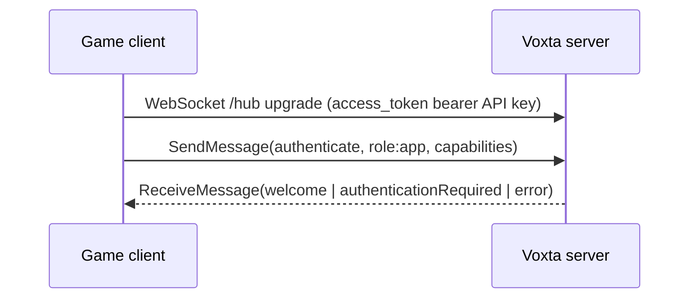
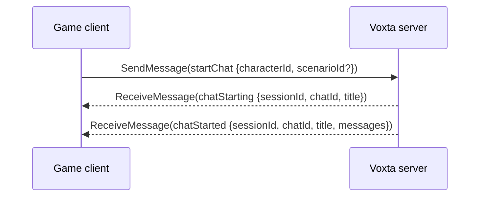
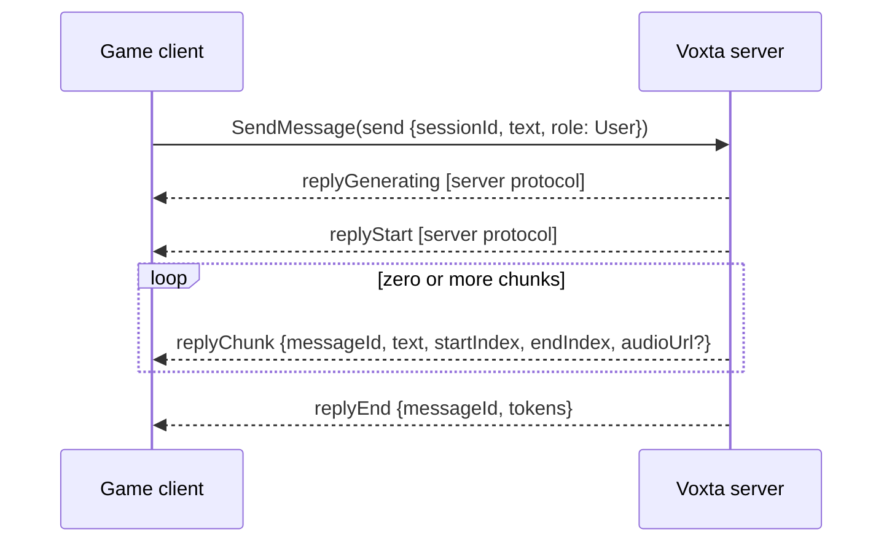
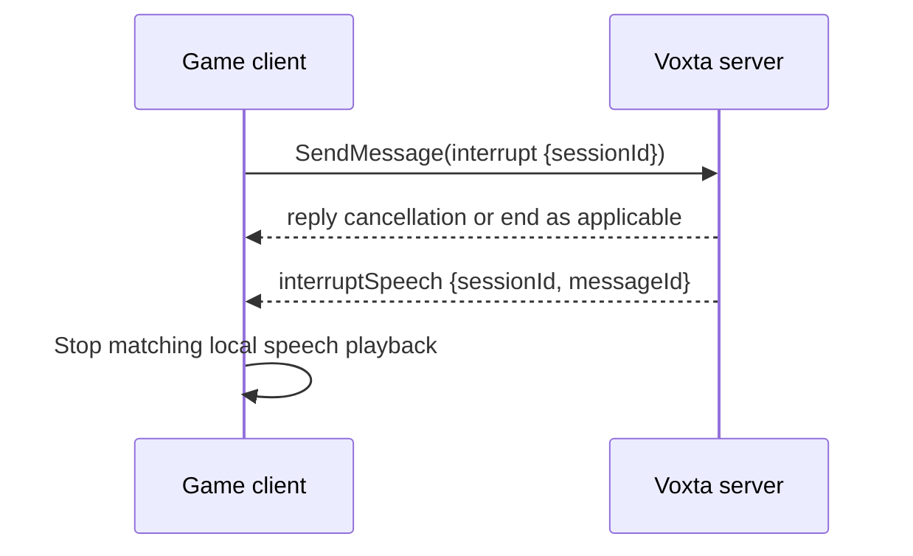
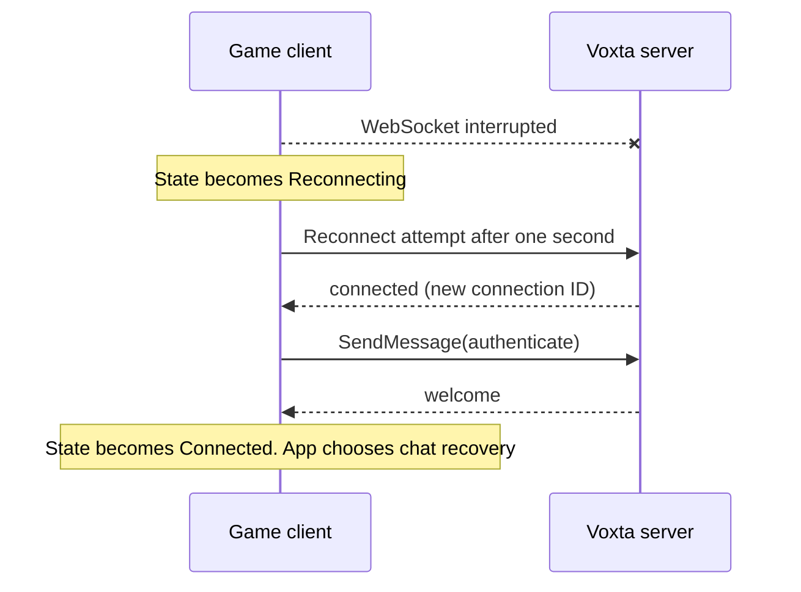

# Voxta Game Engine Protocol Contract v0

**Status:** M2 protocol contract.  
**Protocol pin:** `Voxta.Model` server commit `b533b287194af6fc418900d1384fb2fda2f7d286`.  
**Verified server API version:** `2025-11`.  
**SDK baseline:** Unity 2022.3 / .NET Standard 2.1.

This is the game-engine subset of the Voxta client protocol. It is the shared
reference for Unity and a later Unreal implementation. It distinguishes server
protocol behavior from the smaller M1 implementation where they differ.

## Connection transport

All chat traffic uses the SignalR hub at `/hub`. The client calls
`SendMessage(ClientMessage)` and the server calls `ReceiveMessage(ServerMessage)`.
Use WebSockets only and skip SignalR negotiation.

The configured value is a server base URL. `http` becomes `ws`, `https` becomes
`wss`, and `ws`/`wss` remain unchanged. Remove trailing base-path slashes and
append `/hub`; discard query and fragment components.

| Base URL | Hub URI |
| --- | --- |
| `http://127.0.0.1:5384` | `ws://127.0.0.1:5384/hub` |
| `https://example.test/voxta/` | `wss://example.test/voxta/hub` |
| `ws://example.test/base` | `ws://example.test/base/hub` |
| `wss://example.test` | `wss://example.test/hub` |

Only a server base URL is valid. In particular, an input already ending in
`/hub` becomes `/hub/hub` in the Unity implementation. Other schemes fail.

SignalR receives the API key through `AccessTokenProvider`; the WebSocket
transport sends it as `access_token`. The server also accepts
`Authorization: Bearer <token>` for HTTP and hub requests. Game clients use an
API key with `role:app`; cookies are for browser clients. TLS is required for
non-local deployment because WebSocket query strings can be recorded by
intermediaries.

## Authentication and compatibility handshake

The bearer key authenticates the transport. The first hub message on every new
connection must still be `authenticate`, which identifies the app and its
capabilities:

```json
{
  "$type": "authenticate",
  "client": "Voxta Unity SDK",
  "clientVersion": "0.1.0-pre.1",
  "scope": ["role:app"],
  "capabilities": { "...": "..." }
}
```

The server replies with `welcome`, `authenticationRequired`, or `error`.
`welcome` contains `apiVersion`, server version and commit, registered client
version, and the authenticated user. `authenticationRequired` means the socket
did not have usable transport credentials; replace or obtain the API key and
reconnect. Surface `error.message` and optional `error.details` to the app.

M1 accepts only `welcome.apiVersion == "2025-11"`; this verified value matches
`VoxtaClient.SupportedApiVersion`. It becomes connected only after a compatible
welcome. A missing or incompatible value faults the client.



## M1 capability profile

Capabilities report facilities the client can service, not features it merely
prefers. M1 uses the following generated defaults:

| Capability | M1 value | Meaning |
| --- | --- | --- |
| `audioInput` | `None` | No microphone stream. |
| `audioOutput` | `None` | No reply-audio download or playback. |
| `acceptedAudioContentTypes` | `audio/x-wav` | Unity's URL adapter uses `AudioType.WAV`; it does not enable audio while output is `None`. |
| `visionCapture` | `None` | No image capture. |
| `features` | empty | No optional feature claims. |
| `scope` | `role:app` | Application-client scope. |

The Unity speech player declares `audioOutput: Url` only while an enabled
`VoxtaSpeechPlayer` is attached to the companion. Its explicit
`localServerAudioOutput` setting declares `None` and disables Unity-side
playback. An enabled `VoxtaMicrophone` with an available local input device
declares `audioInput: WebSocketStream`; otherwise the companion declares
`None`. This capability reflects a configured local capture path, rather than
an intention to capture audio later.

### Audio-input streaming

When `audioInput` is `WebSocketStream`, the server controls capture with hub
`recordingRequest { sessionId, enabled }` messages. Unity opens or closes the
microphone and its raw audio socket for that chat session; it does not capture
continuously before the request.

The stream endpoint is a separate authorized WebSocket, resolved from the
server base URL as `/ws/audio/input/stream?sessionId={sessionId}`. It uses the
same bearer API key in its `Authorization` header. Its first frame is a UTF-8
JSON startup object; later audio frames are WebSocket binary messages and
controls are WebSocket text messages:

```json
{
  "contentType": "audio/wav",
  "sampleRate": 16000,
  "channels": 1,
  "bitsPerSample": 16,
  "bufferMilliseconds": 30
}
```

Unity obtains the actual sample rate and channel count from the microphone clip
and reports them in this frame. It converts Unity float samples to signed,
little-endian PCM16 and sends raw PCM bytes, without a WAV header. The server
also accepts WAV frames, but strips their header before forwarding audio to its
pipeline. The Unity client replaces sustained low-RMS frames with
`{"type":"silence","milliseconds":30}`; the server reconstructs those
markers as PCM silence, preserving stream timing. The client retains real
frames for 200 ms after audible input so a short quiet gap does not punch a
hole in an utterance.

The hub can emit `speechRecognitionStart`, `speechRecognitionPartial`,
`speechRecognitionEnd`, and `audioFrame`. Recognition and VAD/audio-frame
callbacks are delivered on Unity's main thread. Partials are display updates;
a nonempty final `speechRecognitionEnd.text` is sent back through the normal
`send { sessionId, text, role: User }` path. This sends one repaired final
transcript per utterance rather than every partial revision. `audioFrame`
contains RMS, voice activity, listening state, and optional noise-floor,
threshold, and held-run telemetry.

### Audio-output selection

`audioOutput` chooses who plays synthesized speech; it is not merely a media
format preference. `None` asks the server to use its configured Audio Output
Service. This is available only when the server considers the connection local
and an eligible server output service is configured. A server configuration can
also prefer its Audio Output Service even when a local client advertises URL
playback.

`Url` asks the server to return client-downloadable audio URLs in reply chunks.
It is required when the server considers the game connection remote, because
the server cannot play audio on the game's machine. It is also the M3 default
for a Unity game connected to a local server: it lets the game mix, spatialize,
interrupt, and observe playback for lip-sync. A future SDK setting may opt into
the server-output mode for a local installation, but the game must then treat
audio as server-owned and cannot provide those Unity-side behaviors.

For a local server, `Url` is a client capability rather than an override. If
the server's Audio Output service has **Use client capability** disabled
(`PreferClientCapability: false`), it deliberately uses its own output even
though Unity advertised URL playback. Enable that server option before testing
Unity routing; remote connections always use a supported client output
capability.

## Chat lifecycle

Chat-scoped messages carry `sessionId`, assigned by `chatStarting` and
`chatStarted`. M1 supports starting a chat and sending text only.

`startChat` can identify a character, scenario, existing chat, or a supported
combination. M1 normally supplies the configured character GUID and optional
scenario GUID. `chatStarted` returns chat ID, title, history, and session ID.



M1 sends `send` with `sessionId`, `text`, and `role: User` (wire value `3`).
`doContinue` and `doReply` default to `true`. The broader server protocol can
emit `replyGenerating` and `replyStart`; the M1 receive subset begins at
`replyChunk`. Each chunk includes text offsets and future-speech values
(`audioUrl`, `audioGapMs`, `affect`). `replyEnd` completes the stream.



When Unity URL playback has an active reply, `VoxtaCompanion.SendText` sends
`interrupt` before the next `send`. The server processes `interrupt` as an
explicit request to abort the current reply; this does not depend on the chat's
implicit `InterruptOnUserMessage` setting.

The server contract defines `interrupt {sessionId}` and may send
`interruptSpeech {sessionId, messageId}`. A speech client stops matching local
audio for either signal. `interrupt` is player initiated and is followed by
the server's `interruptSpeech` when there was active speech. Every reply that
entered playback tracking emits exactly one `speechPlaybackComplete`, including
when interrupted before any audio plays; the server requires this completion
for each `replyStart`/`replyChunk`/`replyEnd` grouping.



## Reconnection

The Unity transport retries after one second while active. SignalR creates a
new connection ID, then the transport sends the original `authenticate`
message. `VoxtaClient` remains authenticating until a new compatible `welcome`.
All public networking callbacks are posted to Unity's main thread.

M1 neither resumes/recreates a chat nor replays sends that fail while the
connection is down. After welcome, the application decides whether a future
`resumeChat` implementation or a new chat is appropriate.



## JSON type and compatibility rules

SignalR JSON uses camel-case names and a top-level `$type` discriminator. It
names a wire message type, not a CLR type. The M1 client sends only
`authenticate`, `startChat`, and `send`; the current M3/M4 implementation also
sends `interrupt`, `speechPlaybackStart`, `speechPlaybackComplete`,
`updateContext`, and `triggerAction`. Client message DTOs are send-only:
attempting to deserialize a `ClientMessage`, or serialize any other client
root, raises `JsonException`.

The receive subset is `welcome`, `authenticationRequired`, `error`,
`chatStarting`, `chatStarted`, `replyStart`, `replyChunk`, `replyEnd`,
`speechPlaybackStart`, `speechPlaybackComplete`, `interruptSpeech`, `action`,
`appTrigger`, `contextUpdated`, `animationPlay`, `chatSessionError`,
`recordingRequest`, `speechRecognitionStart`, `speechRecognitionPartial`,
`speechRecognitionEnd`, and `audioFrame`. Server message DTOs are receive-only.
`ChatMessageRole` accepts either its numeric wire value or an enum name on
receive; Unity writes its numeric value.

The transport receives hub payloads as raw JSON and uses `$type` to materialize
only this generated server subset. Frames with a missing or unknown `$type`,
and malformed non-`action` frames, are ignored so a future frame cannot prevent
later supported messages from reaching Unity. A malformed `action` frame is
additionally reported through the client error callback
because it could otherwise conceal an action-dispatch failure. New supported
server types require a generated DTO, discriminator registration, and explicit
runtime handling; known fields do not override the exact `apiVersion`
compatibility check.

## Minimal REST surface

Resolve REST paths against the server base URL. Send bearer API keys as
`Authorization: Bearer <token>`. Device-flow JSON uses OAuth-style snake case.

| Request | Authentication | Body / result |
| --- | --- | --- |
| `POST /api/device/code` | none | `{ "client_id", "scope": "role:app", "label"? }` to `{ "user_code", "verification_url", "device_code" }` |
| `POST /api/device/poll` | none | `{ "device_code" }`; `204` while pending, then `{ "token": "<API key>" }`; expired/invalid is `400` |
| `POST /api/device/verify` | approving user's browser session | `{ "user_code" }`; mints the key. It is not a game request. |
| `POST /api/auth/test` | bearer token being tested | Returns a success status for a usable app-or-higher token; the Unity auth runtime uses its status only and clears a rejected stored token. |

The reference client polls once per second, with the first poll after one
second, and cancellation stops both the wait and request. The Unity runtime
uses the same timing, validates a received token through `POST /api/auth/test`,
and persists it only after validation. The resulting application-scoped API
key becomes the bearer value for both REST and SignalR.

This sequence was exercised in Unity 2022.3 Play Mode against the pinned local
server: the user opened the returned verification URL, entered the returned
user code, approved the request, and Unity completed polling, validation, and
`PlayerPrefs` persistence.

## M4 action registration and context publication

Actions are registered over the authenticated `/hub` SignalR connection; the
pinned server has no separate action-registration REST endpoint. After the
server sends `chatStarted`, the client publishes an `updateContext` message:

```json
{
  "$type": "updateContext",
  "sessionId": "<chat session GUID>",
  "contextKey": "Unity",
  "actions": [{
    "name": "wave",
    "description": "Wave at the player.",
    "arguments": [{ "name": "hand", "type": 1, "required": true }]
  }]
}
```

`actions` replaces the complete action set for its `contextKey`; sending an
empty array clears the client's registered actions for that key. The server
uses `"Main"` when `contextKey` is omitted, but the Unity `VoxtaActions`
component requires an explicit non-empty key and defaults it to `"Unity"` to
avoid replacing scenario-owned actions. The verified definition fields used by
this unit are `name`, `description`, and argument `name`, `type`,
`description`, `required`, `itemsType`, and `choices`. `FunctionArgumentType`
is numeric on the wire (`String` is `1`).

The server queues `updateContext` as a chat input and imports the supplied
actions at chat priority for that key. It does not acknowledge publication.
Its `contexts` field similarly replaces the complete context set for that key.
Each context has optional `id` and `name`, required `text`, `disabled`,
optional `flagsFilter` and `roleFilter`, numeric `applyTo`, and numeric
`position`. `VoxtaActions.SetContexts` publishes these declarative contexts
together with its action definitions.

A client can directly invoke a registered non-tool action with:

```json
{
  "$type": "triggerAction",
  "sessionId": "<chat session GUID>",
  "messageId": "<persisted chat message GUID>",
  "value": "wave",
  "arguments": [{ "name": "hand", "value": "left" }]
}
```

`messageId` must identify an existing message in the active chat, and `value`
is the action name rather than an action ID. The server resolves matching
actions in the chat context, rejects direct invocation of tool-calling actions,
and forwards optional string arguments to the action invocation. Unity exposes
this as `VoxtaChatSession.TriggerAction`; it validates the active session,
target message ID, and action name before sending.

The pinned server sends an inferred invocation as `action`. It is chat-scoped
and carries `sessionId`, optional `contextKey` and `layer`, required action
`value`, `role`, `senderId`, optional `scenarioRole`, and optional string
arguments:

```json
{
  "$type": "action",
  "sessionId": "<chat session GUID>",
  "contextKey": "Unity",
  "layer": "game",
  "value": "wave",
  "role": "Assistant",
  "senderId": "<sender GUID>",
  "scenarioRole": "Guide",
  "arguments": [{ "name": "hand", "value": "left" }]
}
```

The server serializes `role` by enum name (for example, `"Assistant"`), not
as the enum's numeric value. Unity deserializes this exact subset into `ServerActionMessage` and
`ActionInvocationArgument`. `VoxtaChatSession` forwards an action only when
its `sessionId` matches the active chat. `VoxtaActions` then accepts only the
component's exact `contextKey`, dispatches named C# handlers registered with
`RegisterHandler`, raises its `ActionReceived` event and `OnAction` UnityEvent,
and invokes the matching definition's UnityEvent. SignalR posts every received
message to `UnityMainThreadDispatcher`; consequently all of these callbacks
run on Unity's main thread. Action names and context keys use ordinal matching.

On the pinned server, action inference constructs this `action` message after
an inferred action's effects run, then sends it through the chat tunnel unless
an installed chat augmentation reports that it handled the invocation. Thus an
`Inferred ... action` server log is evidence that the message was constructed,
but not by itself that it was sent to the Unity connection. The explicit Unity
test observes both the raw client message and the dispatched handler so it can
distinguish server-side handling from a Unity session or context-key filter.

The package includes an explicit local-server test which registers
`unity_m4_dispatch_probe`, waits for the server to import the queued context,
then asks the character to invoke it with `hand: left`. It requires the
previous device-flow token and an action-enabled local character; there is no
separate action-registration or action-invocation endpoint.

The direct-trigger verification uses the local Assistant scenario instead of
the text-only test character, because that scenario emits a persisted bootstrap
reply. Unity waits for the bootstrap reply to complete, uses its `messageId` in
`triggerAction`, and publishes a scenario context and the probe action under
`"Unity"`. The server accepted the context update without faulting the
connection and returned the directly triggered `action` to the registered
`VoxtaActions` handler.

### App triggers

Scenario scripts send application effects as a chat-scoped `appTrigger` frame:

```json
{
  "$type": "appTrigger",
  "sessionId": "<chat session GUID>",
  "messageId": "<optional source message GUID>",
  "triggerId": "<optional queued-trigger GUID>",
  "name": "setMood",
  "arguments": ["happy", 3, true],
  "senderId": "<sender GUID>",
  "scenarioRole": "Guide"
}
```

`name` is required; `arguments` is a required nullable array in the pinned
model and each element can be any JSON value. Unity materializes those values
as `JsonElement` values so applications retain their wire type. `messageId`,
`triggerId`, and `scenarioRole` are optional. A normal script trigger has no
`triggerId` and is fire-and-forget. A queued foreground trigger includes one:
the server waits for its completion before continuing that foreground command.

`VoxtaChatSession.AppTriggerReceived` delivers only frames for the active
chat, on Unity's main thread. Once its synchronous subscribers return, Unity
sends:

```json
{
  "$type": "appTriggerComplete",
  "sessionId": "<chat session GUID>",
  "triggerId": "<queued-trigger GUID>"
}
```

Unity never acknowledges a fire-and-forget trigger or a trigger for another
session. A subscriber exception prevents the acknowledgement, leaving the
server's queued operation to its own cancellation path rather than incorrectly
reporting successful delivery. The server validates the completion session ID;
within a valid session, an unknown or duplicate trigger ID is a no-op.

The explicit local-server test starts the dedicated queued-trigger scenario,
waits for server-side scenario initialization after `chatStarted`, then sends a
probe user message. It verifies Unity receives
`unity_m4_app_trigger_probe` with string, integer, and Boolean arguments, a
non-null `triggerId`, and main-thread delivery. The session's automatic
completion acknowledgement leaves the connection usable.

### Context updates, animation playback, and action errors

The server sends `contextUpdated` whenever live scenario state changes. It is
chat-scoped and includes required `sessionId`, `flags`, `characters`, and
`roles`; `flags` entries contain a required name plus optional message and
expiry chat-time/index metadata. Optional `variables` values are arbitrary JSON
and remain `JsonElement` values in Unity. The generated subset also preserves
the optional context, action, tool, button, and control-group lists: contexts
and actions retain their named, typed entries, while each polymorphic control
definition remains raw JSON so applications can interpret only the controls
they support.

`animationPlay` is chat-scoped and carries required `sessionId`, `animationId`,
`url`, and `contentType`; `fileName` and `label` are optional, while
`frameCount` and `fps` are numeric playback metadata. It is a delivery
notification only: the companion API surfaces it but does not download or play
the animation.

Action/session failures arrive as `chatSessionError`, not the connection-wide
`error` frame. The required fields are `sessionId` and `message`; `details` is
optional and `retry` defaults to `true`. Unity exposes all three roots through
matching `VoxtaChatSession` typed C# events and `VoxtaCompanion` typed C# and
UnityEvent callbacks. Session filtering drops frames for another chat, and
SignalR dispatch keeps every callback on Unity's main thread. After its typed
callback, `chatSessionError` is also reported through the companion's existing
error callback as `VoxtaChatSessionException`; it does not fault the transport
or change connection state.

The generated discriminator subset is therefore `contextUpdated`,
`animationPlay`, and `chatSessionError`. Unknown and malformed frames retain
the existing resilient behavior: they are ignored unless a malformed `action`
frame must be reported to avoid concealing action dispatch failure.

For M3, fetch a non-empty `replyChunk.audioUrl` with `GET`, resolving relative
URLs against the server URL and sending `Accept: audio/x-wav`. Deferred URLs
do not have a filename extension, so Unity creates its `DownloadHandlerAudioClip`
with `AudioType.WAV` rather than trying to infer a type from the URL. Treat the URL as
opaque. The Unity adapter uses `UnityWebRequestMultimedia.GetAudioClip` and an
`AudioSource`; it starts each chunk download on receipt, so the next clip can
be ready while the current clip plays. The usual deferred form is
`/api/tts/gens/{id}`, an anonymous,
single-use random nonce. Cached forms may be
`/api/tts/cached/{id}.{extension}?token={token}`. Do not infer filename,
lifetime, reuse, or authorization from a message ID. Empty `audioUrl` means
speech is disabled. Before declaring `audioOutput: Url`, honor `audioGapMs` and
implement `speechPlaybackStart` / `speechPlaybackComplete`. `audioGapMs` is a
minimum time since the preceding clip ended, not an additional delay. Send a
start for every received chunk, with decoded `AudioClip.length` (or zero for a
text-only or failed-download chunk), and send one completion for every reply:
after `replyEnd` and all queued chunks naturally finish, or immediately after
the local stop on interruption. The pinned model also
includes `isNarration` and `affectCarried` on `replyChunk`; the former is
echoed in the start acknowledgement and both remain available to lip-sync
consumers. The server broadcasts the corresponding `speechPlaybackStart` and
`speechPlaybackComplete` messages back to chat clients, so URL-playback clients
must deserialize those echoes even when they do not use them for local control.

## Open questions and upstream follow-up

| Item | Current contract decision | Follow-up |
| --- | --- | --- |
| API compatibility | M1 requires exact `2025-11`; no range or deprecation guarantee is published. | Raise versioning guarantees with server maintainers before the first public SDK tag (M5). No M1 server defect was found, so no issue or PR is warranted. |
| Unknown messages | M1 fails closed. | Keep this rule until feature-level compatibility semantics are published. |
| Reconnect recovery | M1 re-authenticates only; delivery/replay is unspecified. | Define `resumeChat` recovery and delivery guarantees when it enters the generated subset. |
| Audio URL lifetime | URLs are opaque one-shot nonces or tokenized cached resources. | Confirm expiry/retry behavior before implementing audio retries or caching in M3. |

Microphone streaming, speech acknowledgements, actions, vision, and the rest
of the server message catalog are outside this v0 M1 implementation guarantee.
